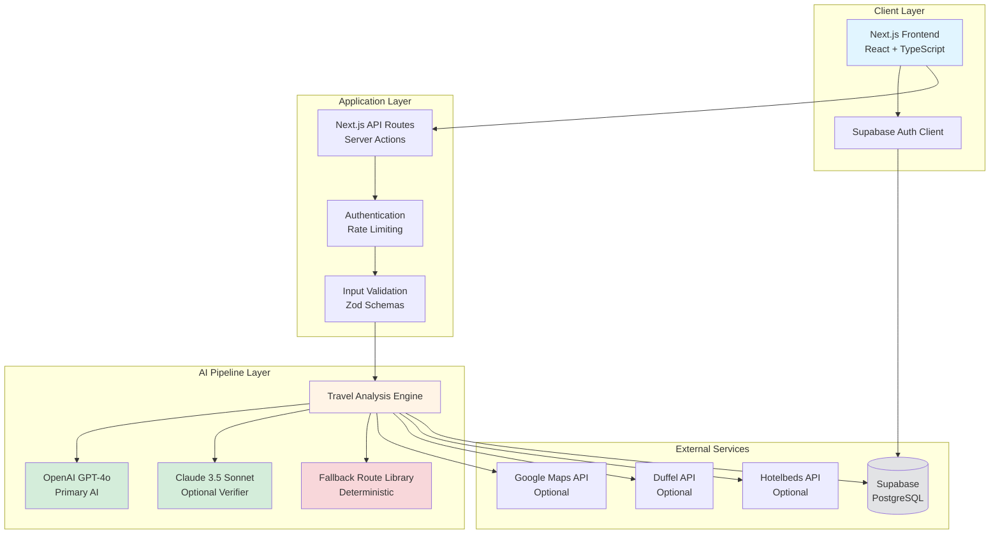
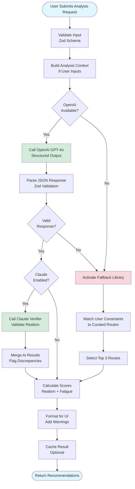
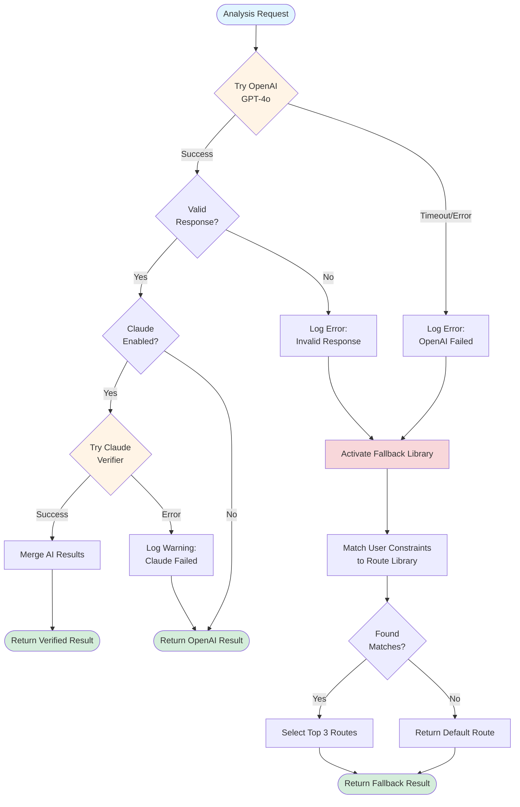
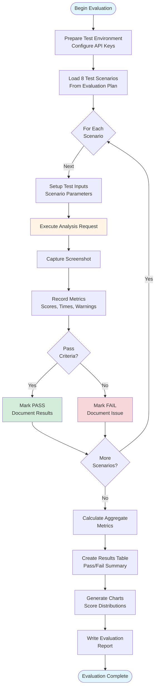
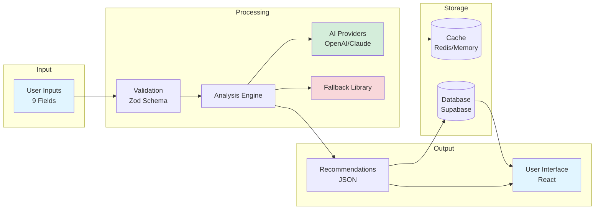
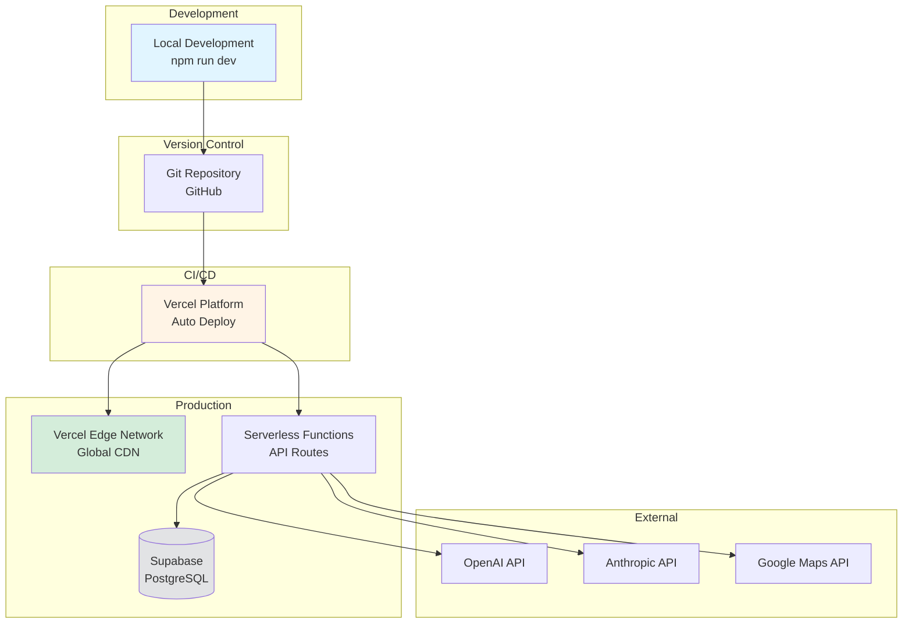

# TravelScan AI - Project Architecture Documentation

## Overview

This document provides a comprehensive architectural overview of TravelScan AI, including system components, data flows, and key design decisions.

---

## 1. System Architecture

### High-Level Architecture Diagram



### Component Breakdown

**Client Layer:**
- Next.js 15 with App Router
- React 18 with TypeScript
- Tailwind CSS + shadcn/ui components
- Supabase Auth client for authentication

**Application Layer:**
- Next.js API routes for backend logic
- Server Actions for data mutations
- Authentication middleware
- Rate limiting per user
- Zod schema validation

**AI Pipeline Layer:**
- Travel Analysis Engine (core logic)
- OpenAI GPT-4o integration
- Claude 3.5 Sonnet verifier (optional)
- Fallback route library (deterministic)

**External Services:**
- Supabase PostgreSQL (user data, saved trips)
- Google Maps API (geocoding, optional)
- Duffel API (flights, optional)
- Hotelbeds API (hotels, optional)

---

## 2. AI Recommendation Pipeline

### AI Pipeline Flow Diagram



### Pipeline Steps Explained

**Step 1: Input Validation**
- Validate 9 user inputs against Zod schema
- Ensure all required fields present
- Check data types and ranges
- Reject invalid requests early

**Step 2: Build Analysis Context**
- Combine user inputs into structured prompt
- Add system instructions
- Format for AI consumption
- Include constraints and preferences

**Step 3: Primary AI Generation (OpenAI)**
- Call GPT-4o with structured output format
- Request JSON matching Zod schema
- Set temperature to 0.3 for consistency
- Track token usage and cost

**Step 4: Response Validation**
- Parse JSON response
- Validate against Zod schema
- Check all required fields present
- Verify data types and ranges

**Step 5: Optional Verification (Claude)**
- If enabled, send recommendation to Claude
- Request realism validation
- Compare with OpenAI output
- Flag significant discrepancies

**Step 6: Fallback Activation**
- Triggered if OpenAI fails or returns invalid data
- Match user constraints to curated routes
- Select top 3 matching routes
- Format as standard recommendation

**Step 7: Score Calculation**
- Calculate route realism score (0-100)
- Determine travel fatigue level (Low/Med/High)
- Compute confidence score
- Add warnings if needed

**Step 8: Output Formatting**
- Structure data for UI display
- Add consultant notes
- Include warnings and alternatives
- Return to user

---

## 3. Provider Fallback Flow

### Fallback Mechanism Diagram



### Fallback Strategy

**Level 1: Primary AI (OpenAI)**
- First attempt: OpenAI GPT-4o
- Timeout: 30 seconds
- Retries: 2 attempts
- On failure: Proceed to fallback

**Level 2: Verifier (Claude - Optional)**
- Second layer: Claude 3.5 Sonnet
- Purpose: Validate realism
- On failure: Use OpenAI result only
- Not critical for operation

**Level 3: Fallback Library (Deterministic)**
- Last resort: Curated routes
- Guaranteed: 100% reliability
- Matching: Based on user constraints
- Quality: Pre-validated routes

**Graceful Degradation:**
- External APIs (Google Maps, Duffel, Hotelbeds) are optional
- System works without them
- Manual input accepted if APIs unavailable
- Estimates used instead of real-time data

---

## 4. User Flow

### Complete User Journey Diagram

```mermaid
flowchart TD
    Start([User Visits Landing Page]) --> ViewLanding[View Features<br/>& Benefits]
    ViewLanding --> Decide{Interested?}
    
    Decide -->|No| Leave([Leave Site])
    Decide -->|Yes| Signup[Sign Up<br/>Supabase Auth]
    
    Signup --> VerifyEmail[Verify Email<br/>Optional]
    VerifyEmail --> Login[Login to Dashboard]
    
    Login --> Dashboard[View Dashboard<br/>Stats & Overview]
    Dashboard --> StartAnalysis[Click "New Analysis"]
    
    StartAnalysis --> FillForm[Fill Analysis Form<br/>9 Input Fields]
    FillForm --> SelectStructure[Select Trip Structure<br/>Single/Multi-City/Country]
    SelectStructure --> Submit[Submit Request]
    
    Submit --> ShowLoading[Show Loading Animation<br/>Travel-Themed]
    ShowLoading --> ProcessAI[AI Processing<br/>5-15 seconds]
    
    ProcessAI --> ShowResults[Display Top 3<br/>Recommendations]
    ShowResults --> ReviewCard[Review Recommendation<br/>Route, Scores, Warnings]
    
    ReviewCard --> UserAction{User<br/>Action?}
    
    UserAction -->|View Details| ExpandCard[View Full Details<br/>Route Map, Notes]
    UserAction -->|Save Trip| SaveTrip[Save to Profile]
    UserAction -->|Feedback| SubmitFeedback[Thumbs Up/Down]
    UserAction -->|New Analysis| FillForm
    
    ExpandCard --> UserAction
    SaveTrip --> ViewSaved[View Saved Trips]
    SubmitFeedback --> UserAction
    
    ViewSaved --> Revisit{Revisit<br/>Later?}
    Revisit -->|Yes| Dashboard
    Revisit -->|No| Logout([Logout])
    
    style Start fill:#e1f5ff
    style ProcessAI fill:#fff4e6
    style ShowResults fill:#d4edda
    style Logout fill:#e2e3e5
```

### User Journey Steps

**1. Discovery (Landing Page)**
- User arrives at landing page
- Views value proposition
- Reads features and benefits
- Decides to try the service

**2. Authentication**
- Signs up with email/password
- Verifies email (optional)
- Logs in to dashboard

**3. Dashboard**
- Views overview and stats
- Sees saved trips (if any)
- Clicks "New Analysis" button

**4. Analysis Request**
- Fills 9-field guided form
- Selects trip structure (key decision)
- Submits request

**5. AI Processing**
- Sees travel-themed loading animation
- Waits 5-15 seconds
- Receives top 3 recommendations

**6. Review Results**
- Views recommendation cards
- Checks route details
- Reviews realism scores
- Reads warnings (if any)

**7. User Actions**
- View full details
- Save trip for later
- Provide feedback
- Start new analysis

**8. Return Visits**
- Access saved trips
- Review previous recommendations
- Create new analyses

---

## 5. Evaluation Workflow

### Test Scenario Execution Flow



### Evaluation Metrics Collected

**Per Scenario:**
- Input parameters
- Generated recommendations
- Route realism scores
- Travel fatigue levels
- Warnings issued
- Fallback activations
- Response times
- Pass/fail status

**Aggregate Metrics:**
- Route structure compliance (%)
- Average realism score
- Fatigue accuracy (%)
- Warning quality (%)
- Fallback reliability (%)
- Average response time (seconds)
- Overall success rate (%)

---

## 6. Data Flow Architecture

### Data Flow Diagram



---

## 7. Technology Stack

### Frontend
- **Framework:** Next.js 15 (App Router)
- **Language:** TypeScript
- **UI Library:** React 18
- **Styling:** Tailwind CSS
- **Components:** shadcn/ui
- **Icons:** Lucide React
- **Animations:** CSS keyframes + Tailwind
- **Forms:** React Hook Form (if used)

### Backend
- **Runtime:** Node.js
- **Framework:** Next.js API Routes + Server Actions
- **Language:** TypeScript
- **Validation:** Zod
- **Authentication:** Supabase Auth
- **Database:** Supabase PostgreSQL

### AI & ML
- **Primary AI:** OpenAI GPT-4o
- **Verifier:** Anthropic Claude 3.5 Sonnet
- **SDKs:** OpenAI SDK, Anthropic SDK
- **Prompt Engineering:** Structured output with JSON schema
- **Validation:** Zod schema enforcement

### External APIs
- **Maps:** Google Maps API (optional)
- **Flights:** Duffel API (optional)
- **Hotels:** Hotelbeds API (optional)

### DevOps
- **Deployment:** Vercel
- **Version Control:** Git + GitHub
- **CI/CD:** Vercel automatic deployments
- **Monitoring:** Vercel Analytics (if enabled)

---

## 8. Key Design Decisions

### 1. Hybrid AI Approach
**Decision:** Use OpenAI + optional Claude + deterministic fallback

**Rationale:**
- OpenAI provides creative recommendations
- Claude adds verification layer
- Fallback ensures 100% reliability
- Best of both worlds: AI creativity + guaranteed uptime

**Trade-offs:**
- Increased complexity
- Higher API costs (if Claude enabled)
- Longer response times with verification

---

### 2. Structured Output with Zod
**Decision:** Enforce JSON schema validation on all AI responses

**Rationale:**
- Prevents hallucinations from breaking UI
- Ensures consistent data structure
- Enables type safety in TypeScript
- Allows graceful fallback on invalid data

**Trade-offs:**
- More rigid than free-form text
- Requires careful prompt engineering
- May limit AI creativity slightly

---

### 3. Route Realism Scoring
**Decision:** Quantify route quality with 0-100 score

**Rationale:**
- Provides objective quality metric
- Helps users compare recommendations
- Validates AI suggestions
- Prevents unrealistic routes

**Components:**
- Geographic coherence (30%)
- Transfer feasibility (25%)
- Time allocation (20%)
- Seasonal appropriateness (15%)
- Budget alignment (10%)

---

### 4. Travel Fatigue Analysis
**Decision:** Categorize trips as Low/Medium/High fatigue

**Rationale:**
- Prevents exhausting itineraries
- Warns users about rushed trips
- Improves trip quality
- Unique feature vs. competitors

**Thresholds:**
- Low: ≤1 city per 4+ days
- Medium: 1 city per 2-3 days
- High: >1 city per 2 days

---

### 5. Graceful Degradation
**Decision:** System works even when external APIs fail

**Rationale:**
- Ensures reliability
- Reduces dependency on third parties
- Provides consistent user experience
- Fallback library guarantees uptime

**Implementation:**
- OpenAI fails → Fallback library
- Google Maps missing → Manual input
- Duffel/Hotelbeds missing → Estimates

---

### 6. Next.js App Router
**Decision:** Use Next.js 15 with App Router (not Pages Router)

**Rationale:**
- Modern React Server Components
- Better performance
- Improved routing
- Server Actions for mutations

**Trade-offs:**
- Steeper learning curve
- Some features still experimental
- Migration from Pages Router complex

---

## 9. Security Considerations

### Authentication
- Supabase Auth with email/password
- JWT tokens for session management
- Row-level security in database
- Server-side auth checks

### API Key Protection
- All keys server-side only
- Never exposed to client
- Environment variables
- Not committed to Git

### Input Validation
- Zod schema validation
- XSS prevention
- SQL injection prevention (parameterized queries)
- Rate limiting per user

### Data Privacy
- User data encrypted at rest (Supabase)
- HTTPS for all connections
- No sensitive data in logs
- GDPR compliance considerations

---

## 10. Performance Optimizations

### Caching
- AI responses cached (optional)
- Static pages pre-rendered
- API responses cached where appropriate

### Code Splitting
- Next.js automatic code splitting
- Lazy loading for heavy components
- Dynamic imports for optional features

### Database
- Indexed queries
- Connection pooling (Supabase)
- Efficient query design

### AI Optimization
- Temperature 0.3 for consistency
- Token usage tracking
- Cost monitoring
- Timeout limits (30s)

---

## 11. Scalability Considerations

### Current Architecture
- Serverless (Vercel)
- Auto-scaling
- No server management
- Pay-per-use

### Bottlenecks
- AI API rate limits
- Database connections
- External API quotas

### Future Scaling
- Add caching layer (Redis)
- Implement queue system for high load
- Consider dedicated AI infrastructure
- Database read replicas

---

## 12. Deployment Architecture



---

## Conclusion

TravelScan AI's architecture is designed for:
- **Reliability:** Hybrid AI + fallback ensures 100% uptime
- **Quality:** Realism scoring + fatigue analysis prevent bad recommendations
- **Scalability:** Serverless architecture scales automatically
- **Maintainability:** Clean separation of concerns, TypeScript safety
- **User Experience:** Fast, responsive, professional interface

The combination of modern web technologies, AI capabilities, and thoughtful design decisions creates a production-ready travel planning system that fills a clear gap in the market.
